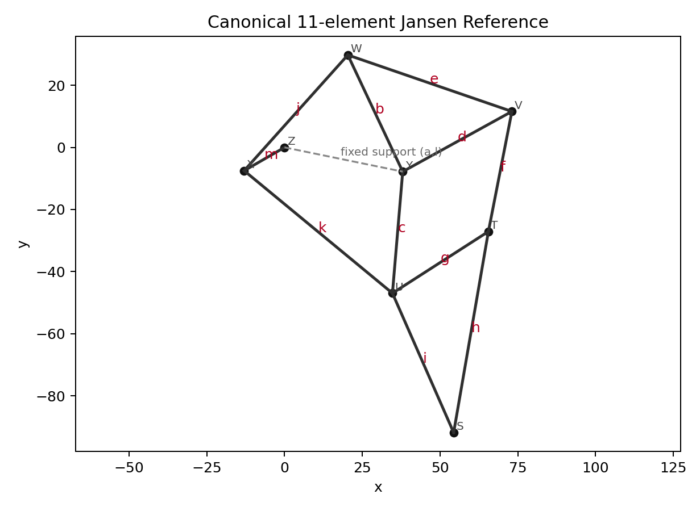
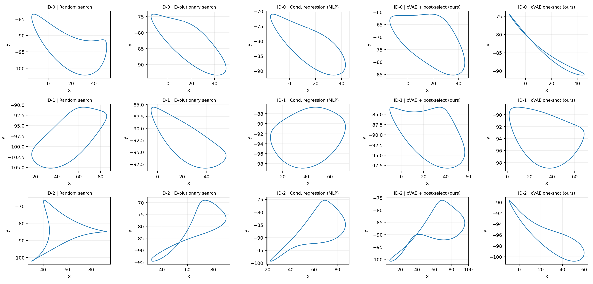

# Conditional Generative Design of Strandbeest Linkages

Conditional generative pipeline for inverse design of Strandbeest-style planar linkages with a kinematics-based evaluator.

Given a **target gait-property vector** — step length, foot clearance, duty factor, and smoothness — a conditional VAE (cVAE) proposes feasible 11-parameter linkage configurations. Candidates are evaluated by an analytical forward kinematics solver and optionally post-selected by minimum target error.

---

## Linkage Parameterization

The design space follows the canonical Theo Jansen 11-bar linkage. The 11 actively optimized link lengths are:

$$\mathbf{x}_{11} = [m,\, b,\, c,\, d,\, e,\, f,\, g,\, h,\, i,\, j,\, k] \in \mathbb{R}^{11}$$

The ground support geometry $(a, l)$ is held fixed to prevent kinematic drift.



---

## Quickstart

```bash
pip install -r requirements.txt
pip install -e .

# Reproduce all results
python scripts/run_full_pipeline.py --output runs/default
```

Outputs (model weights, figures, tables) are written to `runs/default/`.

---

## Project Structure

```
src/strandbeest/
  reference.py     – canonical 11-parameter Jansen linkage definition
  kinematics.py    – forward kinematics and gait metric computation (T=360 crank angles)
  data.py          – dataset generation (N=6000 feasible samples) and query sampling
  models.py        – cVAE (latent dim k=12) and conditional MLP (training + inference)
  baselines.py     – random search and evolutionary search (budget B=128)
  evaluation.py    – per-query metrics: Success@ε, standardized L2 error, violation rate
  pipeline.py      – end-to-end experiment orchestration
scripts/
  run_full_pipeline.py         – main reproducible entrypoint
  generate_reference_assets.py – regenerate reference schematic and CSV
tests/                         – smoke tests for kinematics solver
```

---

## Methods

All methods are budget-matched to **B = 128** kinematics evaluator calls per query.

| Method | Description |
|--------|-------------|
| **cVAE + post-select** (ours) | Sample K=128 latent candidates, evaluate all, return best |
| **cVAE one-shot** (ours) | Single latent sample, no post-selection (1 evaluator call) |
| **Conditional MLP** | Deterministic regressor with MSE training, perturbed at inference |
| **Evolutionary search** | Population size 40, top-35% elites, 10% mutation noise |
| **Random search** | Uniform sampling baseline |

---

## Main Results

Under a fixed evaluation budget of **B = 128** kinematics evaluator calls per query, cVAE with post-selection achieves **99.2% Success@ε** (ε = 1.0) on in-distribution targets, outperforming budget-matched evolutionary search, random search, and the conditional MLP regressor.

---

## Qualitative Results

Representative foot-tip trajectories produced by each method across three ID target queries. The cVAE + post-select approach (column 4) consistently yields smooth, closed-loop trajectories that best match the target gait profile.


